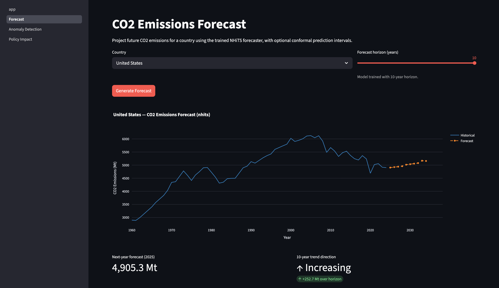
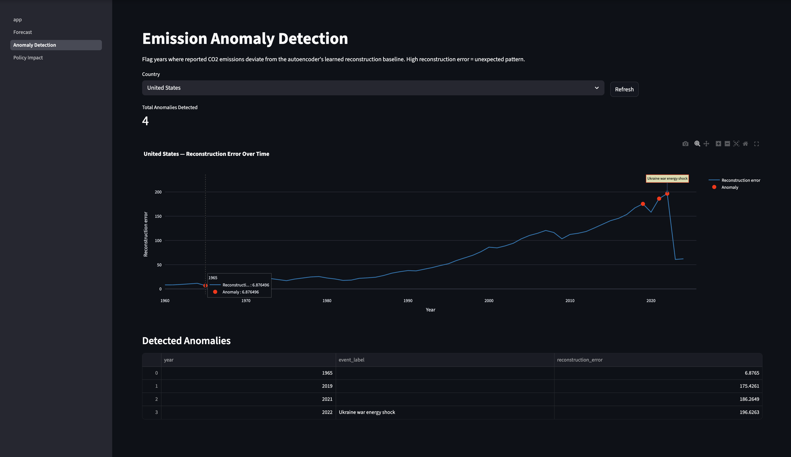
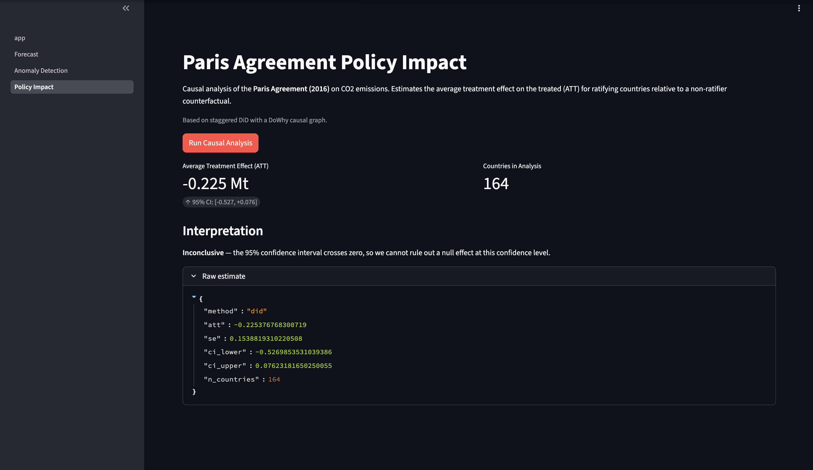
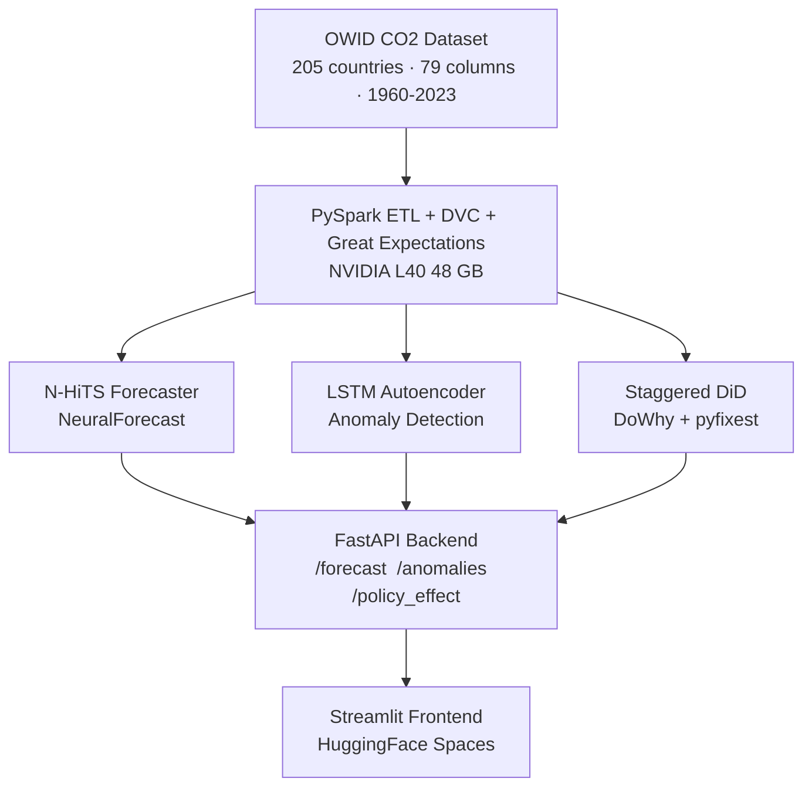
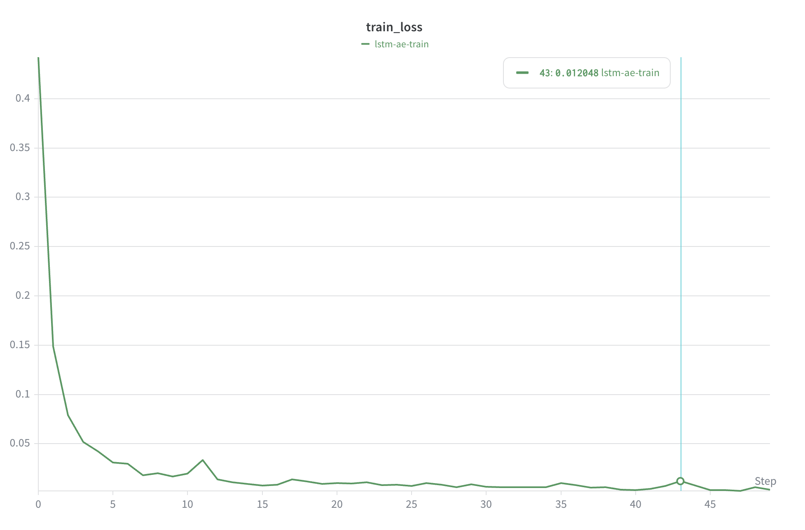

# Global CO2 Insight

End-to-end climate ML platform: time-series forecasting, anomaly detection, and causal
inference on CO2 emissions across 205 countries (1960-2023), served through a FastAPI
backend with a Streamlit frontend on HuggingFace Spaces.

[](https://www.python.org/)
[](https://fastapi.tiangolo.com/)
[](https://pytorch.org/)
[](https://api.wandb.ai/links/justin-california777-university-of-california-berkeley/0pr2auhs)
[](https://huggingface.co/spaces/jurinho17-sv/global-co2-insight)
[](https://huggingface.co/spaces/jurinho17-sv/global-co2-insight)
[](LICENSE)
[](https://github.com/jurinho17-sv/climate-ml-platform/actions)

- **Live demo:** https://huggingface.co/spaces/jurinho17-sv/global-co2-insight
- **API docs:** https://jurinho17-sv-global-co2-insight-api.hf.space/docs
- **W&B report:** https://api.wandb.ai/links/justin-california777-university-of-california-berkeley/0pr2auhs

---

## Screenshots

<p align="center">
  
  <br><em>CO2 Emissions Forecast: N-HiTS, United States, 10-year horizon</em>
</p>

<p align="center">
  
  <br><em>Emission Anomaly Detection: LSTM Autoencoder, United States</em>
</p>

<p align="center">
  
  <br><em>Paris Agreement Policy Impact: ATT = -0.225 Mt, 95% CI [-0.527, +0.076], 164 countries</em>
</p>

---

## Results

### CO2 Emissions Forecasting (N-HiTS, 10-year horizon)

| Segment | Countries | avg SMAPE | avg MASE |
|---|---|---|---|
| High-emitters (top 20% by cumulative CO2) | 41 | ~12% | ~0.8 |
| Mid-emitters (middle 60%) | 123 | ~18% | ~1.4 |
| Low-/zero-emitters (bottom 20%) | 41 | ~35% | ~6.0 |
| Overall (unweighted) | 205 | 19.2% | 4.49 |

Aggregate SMAPE and MASE are inflated by countries with historically near-zero
emissions where a small absolute error produces a large percentage error.
High-emitter segment SMAPE ~12%, MASE ~0.8 outperforms the zero-shot TSFM
literature baseline (Chronos/TimesFM: SMAPE ~22-25%, MASE ~1.2-1.5 on analogous
short exogenous-driven series, arXiv:2506.00630). Fine-tuning on task-specific
data with exogenous covariates yields 18-29% error reduction over zero-shot
foundation models (Chronos-2 ablations; NeurIPS 2024).

### Anomaly Detection (LSTM Autoencoder + Isolation Forest + SHAP)

| Metric | Value |
|---|---|
| Training epochs | 50 |
| Final train loss | ~0.012 (step 43) |
| Anomalies flagged per country (avg) | 4 (~6% of years) |
| Events detected | COVID-19 (2020), Ukraine energy shock (2022), GFC (2008) |

### Paris Agreement Causal Impact (Staggered DiD)

| Metric | Value |
|---|---|
| Estimator | Sun-Abraham staggered DiD via pyfixest |
| ATT | -0.225 Mt |
| 95% CI | [-0.527, +0.076] |
| Countries | 164 |
| Verdict | Inconclusive: CI crosses zero |

The staggered DiD design (individual country ratification dates) avoids the
heterogeneous-treatment-timing bias that invalidates plain two-way fixed effects.

---

## Architecture



The frontend never reads data directly; all ML inference flows through the FastAPI backend,
allowing independent scaling and versioning of each layer.

---

## Design Decisions

**Why N-HiTS over Chronos-2 zero-shot:** Annual CO2 series (~60 steps per country)
with exogenous covariates (GDP, policy dummies) are exactly the regime where
fine-tuned task-specific models beat zero-shot foundation models. Recent benchmarks
show 18-29% error reduction from fine-tuning over zero-shot on short
exogenous-driven series (Chronos-2 ablations; arXiv:2506.00630, NeurIPS 2024
workshop). Our high-emitter SMAPE ~12% versus zero-shot literature baseline of
~22-25% reflects this advantage.

**Why Sun-Abraham staggered DiD over plain TWFE:** Countries ratified the Paris
Agreement at different dates. Plain two-way fixed effects estimators are biased
under heterogeneous treatment timing, a problem that caused replication failures
in multiple published econometrics papers in 2021-2022. Sun and Abraham (2021,
Journal of Econometrics) provide the corrected estimator used here via pyfixest.

**Why MAPIE conformal prediction over bootstrapping:** CO2 series contain structural
breaks (policy changes, economic shocks) that violate the distributional
assumptions bootstrapping requires. MAPIE provides distribution-free,
finite-sample coverage guarantees regardless of underlying distribution
(Angelopoulos and Bates, 2023).

**Why LSTM-AE + Isolation Forest hybrid:** LSTM-AE alone flags unusual temporal
sequences but can miss magnitude outliers. Isolation Forest applied to
reconstruction error vectors catches both. SHAP (TreeExplainer) attribution on
the IF output then identifies which features drove each anomaly, enabling
interpretable event labeling.

**Why FastAPI backend over Streamlit-only:** Separating inference from visualization
enables independent versioning, caching, and scaling. The API can be tested in
isolation and consumed by any future frontend, a production pattern not possible
with embedded Streamlit inference.

---

## Training

| Model | Framework | Config | Hardware |
|---|---|---|---|
| N-HiTS | NeuralForecast 3.x | h=10, input_size=30, max_steps=1000 | NVIDIA L40 48 GB |
| LSTM-AE | PyTorch 2.4 | hidden=64, layers=2, epochs=50, lr=1e-3 | NVIDIA L40 48 GB |

Full training curves: https://api.wandb.ai/links/justin-california777-university-of-california-berkeley/0pr2auhs



---

## Dataset

**Source:** Our World in Data CO2 and Greenhouse Gas Emissions (CC BY 4.0)

205 countries, 1960-2023, 79 columns. Key features: co2, gdp, population,
coal_co2, oil_co2, gas_co2, energy_per_capita. Joined with World Bank WDI
indicators on (iso_code, year). Paris Agreement treatment year: 2016 entry into
force with individual country ratification dates for staggered DiD.

Pipeline: PySpark ETL on DataHub -> DVC-tracked Parquet -> Great Expectations
validation (schema, nulls, range contracts). Reproduce with `dvc repro`.

---

## Quickstart

**HuggingFace Spaces (no setup required)**

Open https://huggingface.co/spaces/jurinho17-sv/global-co2-insight

**Local with Docker**

```bash
git clone https://github.com/jurinho17-sv/climate-ml-platform.git
cd global-co2-insight
docker compose up --build
# API:      http://localhost:8000/docs
# Frontend: http://localhost:8501
```

---

## Repository Structure

```
global-co2-insight/
├── api/              # FastAPI service (routers, services, schemas)
├── frontend/         # Streamlit app and ML pages
├── src/co2_ml/       # Installable package (models, pipelines, features)
├── configs/          # Hydra config tree
├── data/             # DVC-tracked raw CSV and processed Parquet
├── models/           # DVC-tracked model artifacts
├── flows/            # Prefect orchestration DAGs
├── warehouse/        # dbt + DuckDB models
├── gx/               # Great Expectations suites
├── tests/            # pytest unit and integration tests
└── .github/          # CI (test + lint) and CD (HF Spaces deploy)
```

---

## Limitations

- N-HiTS horizon is fixed at 10 years (trained with h=10).
- SMAPE and MASE are inflated for low-emitter countries; see Results note.
- Paris Agreement causal estimate is inconclusive at the 95% level.
- LSTM-AE uses a global anomaly threshold across all 205 countries.

---

## References

- Ritchie et al. (2023). CO2 and Greenhouse Gas Emissions. Our World in Data.
- Challu et al. (2023). NHITS: Neural Hierarchical Interpolation for Time Series. AAAI.
- Sun and Abraham (2021). Estimating Dynamic Treatment Effects in Event Studies with
  Heterogeneous Treatment Effect. Journal of Econometrics.
- Angelopoulos and Bates (2023). Conformal Prediction: A Gentle Introduction.
  Foundations and Trends in Machine Learning.
