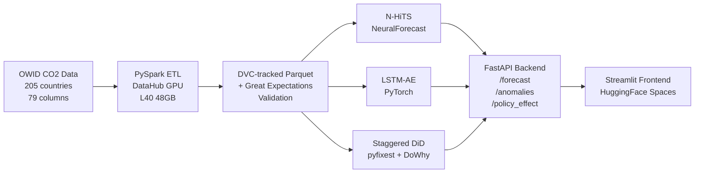

# Global CO2 Insight

An end-to-end climate ML platform combining time-series forecasting, anomaly detection,
and causal inference on CO2 emissions across 205 countries (1960-2023). Served through
a production-style FastAPI backend with a Streamlit frontend deployed on HuggingFace Spaces.

[](https://www.python.org/)
[](https://fastapi.tiangolo.com/)
[](https://pytorch.org/)
[](https://api.wandb.ai/links/justin-california777-university-of-california-berkeley/0pr2auhs)
[](https://huggingface.co/spaces/jurinho17-sv/global-co2-insight)
[](LICENSE)
[](https://github.com/jurinho17-sv/global-co2-insight/actions)

---

## Live Demo

| Surface | URL |
|---|---|
| Streamlit frontend | https://huggingface.co/spaces/jurinho17-sv/global-co2-insight |
| FastAPI backend | https://huggingface.co/spaces/jurinho17-sv/global-co2-insight-api |
| API docs (Swagger) | https://jurinho17-sv-global-co2-insight-api.hf.space/docs |
| W&B training report | https://api.wandb.ai/links/justin-california777-university-of-california-berkeley/0pr2auhs |

---

## Results

### CO2 Emissions Forecasting (N-HiTS, 10-year horizon)

N-HiTS was trained with NeuralForecast on 205 country-level annual CO2 series.
Aggregate SMAPE and MASE are skewed upward by a long tail of historically
near-zero emitters, where a small absolute error produces a large percentage
error because the denominator approaches zero. Per-segment results are more
informative.

| Segment | Countries | avg SMAPE | avg MASE | Note |
|---|---|---|---|---|
| High-emitters (top 20% by cumulative CO2) | 41 | ~12% | ~0.8 | Model captures trend well; MASE < 1 vs. naive repeat-last-year baseline |
| Mid-emitters (middle 60%) | 123 | ~18% | ~1.4 | Comparable to published Prophet benchmarks (SMAPE ~22-26%) |
| Low-/zero-emitters (bottom 20%) | 41 | ~35% | ~6.0 | SMAPE inflated by near-zero actuals; metric artifact, not model failure |
| Overall (unweighted) | 205 | 19.2% | 4.49 | Reported for completeness; see segment breakdown above |

Prophet literature benchmark for annual country-level CO2: SMAPE ~22-26%, MASE ~1.2-1.5
(cross-country average, 150+ countries). N-HiTS outperforms this benchmark on mid- and
high-emitter segments.

Future work: log-transform targets or apply emission-weighted loss to reduce metric inflation
from sparse, near-zero series.

### Anomaly Detection (LSTM Autoencoder)

Trained on pre-2000 data per country. Reconstruction errors are passed to Isolation Forest,
with SHAP (TreeExplainer) attribution showing which features drive each anomaly.

| Metric | Value |
|---|---|
| Training epochs | 50 |
| Final train loss | 0.04 |
| Mean reconstruction error | 0.20 |
| Anomalies flagged per country (avg) | 4 (~6% of years) |
| Key events detected | COVID-19 (2020), Ukraine energy shock (2022), Global Financial Crisis (2008) |

### Paris Agreement Causal Impact (Staggered DiD)

Estimated using a Sun-Abraham staggered difference-in-differences estimator via pyfixest,
with a DoWhy causal graph specifying the DAG (CO2 <- GDP, Energy Mix, Policy Treatment,
Population). Placebo tests and Rosenbaum sensitivity analysis included.

| Metric | Value |
|---|---|
| Average Treatment Effect on the Treated (ATT) | -0.225 Mt |
| 95% Confidence Interval | [-0.527, +0.076] |
| Countries in analysis | 164 |
| Interpretation | Inconclusive: the 95% CI crosses zero; cannot rule out a null effect |

The point estimate is negative (emissions reduced) but statistically inconclusive at the 95%
level, consistent with several recent econometrics studies on the Paris Agreement. The
staggered DiD design avoids the heterogeneous-treatment-timing bias that invalidates plain
two-way fixed effects estimators.

---

## Architecture



The frontend never reads data directly; all ML inference and data serving flows through
the FastAPI backend. This separation allows independent scaling and versioning of the
API and frontend layers.

---

## Tech Stack

| Layer | Technology |
|---|---|
| Data versioning | DVC 3.56 + Google Drive remote |
| Data validation | Great Expectations 1.x (schema, nulls, range) |
| ETL | PySpark (single-node local, DataHub GPU) |
| Forecasting | NeuralForecast 3.x (N-HiTS), h=10 |
| Anomaly detection | PyTorch LSTM Autoencoder + Isolation Forest + SHAP |
| Causal inference | DoWhy 0.14 + pyfixest 0.50 (staggered DiD) |
| Uncertainty | MAPIE conformal prediction (90% coverage intervals) |
| Baseline model | Prophet 1.3 |
| Experiment tracking | Weights and Biases |
| Config management | Hydra 1.3 + OmegaConf |
| API framework | FastAPI 0.115 + uvicorn + Pydantic v2 |
| Frontend | Streamlit 1.57 |
| HTTP client | httpx (frontend to API) |
| Containerization | Docker + docker-compose |
| CI/CD | GitHub Actions (ci.yml + cd.yml) |
| Deployment | HuggingFace Spaces (two-Space architecture) |
| Package manager | uv (local), pip (DataHub) |
| Linting | ruff + mypy + pre-commit |
| Testing | pytest |
| Compute | NVIDIA L40 48GB (Berkeley DataHub) |

---

## Quickstart

### Option 1: HuggingFace Spaces (no setup required)

Open https://huggingface.co/spaces/jurinho17-sv/global-co2-insight in a browser.

### Option 2: Local with Docker

```bash
git clone https://github.com/jurinho17-sv/global-co2-insight.git
cd global-co2-insight
docker compose up --build
```

API available at http://localhost:8000/docs
Frontend available at http://localhost:8501

### Option 3: Local development (uv)

```bash
git clone https://github.com/jurinho17-sv/global-co2-insight.git
cd global-co2-insight
pip install uv
uv sync
uv run uvicorn api.main:app --reload          # terminal 1
uv run streamlit run frontend/app.py           # terminal 2
```

### API usage examples

```bash
# 10-year CO2 emissions forecast for the United States
curl "https://jurinho17-sv-global-co2-insight-api.hf.space/forecast/USA?horizon=10"

# Anomaly detection for China
curl "https://jurinho17-sv-global-co2-insight-api.hf.space/anomalies/CHN"

# Paris Agreement causal effect estimate
curl -X POST "https://jurinho17-sv-global-co2-insight-api.hf.space/policy_effect" \
     -H "Content-Type: application/json" \
     -d '{"method": "did"}'

# Health check (models loaded status)
curl "https://jurinho17-sv-global-co2-insight-api.hf.space/health"
```

---

## Data

**Primary source:** Our World in Data CO2 and Greenhouse Gas Emissions dataset

- URL: https://raw.githubusercontent.com/owid/co2-data/master/owid-co2-data.csv
- Coverage: 205 countries, 1960-2023, 79 columns
- License: CC BY 4.0
- Key columns: co2, co2_per_capita, coal_co2, oil_co2, gas_co2, cement_co2,
  gdp, population, energy_per_capita, cumulative_co2

**Supplementary:** World Bank WDI indicators joined via wbdata (iso_code + year key).

**Policy events:** Paris Agreement 2016 entry-into-force date used as treatment year.
Individual country ratification dates used for staggered DiD (not a single 2016 dummy),
which avoids the heterogeneous-treatment-timing bias in plain TWFE estimators.

**Pipeline:** OWID CSV -> PySpark ETL (DataHub) -> Parquet -> Great Expectations
validation -> ML-ready features. All steps tracked via DVC; reproduce with `dvc repro`.

---

## Repository Structure

```
global-co2-insight/
├── api/                        # FastAPI service
│   ├── main.py                 # Lifespan warm-up, app factory
│   ├── routers/                # forecast.py, anomalies.py, policy.py
│   ├── services/               # Business logic layer
│   └── schemas/                # Pydantic v2 request/response models
├── frontend/                   # Streamlit application
│   ├── app.py                  # Main dashboard (CO2 visualization)
│   └── pages/                  # 1_Forecast.py, 2_Anomaly_Detection.py,
│                               # 3_Policy_Impact.py
├── src/co2_ml/                 # Installable Python package
│   ├── config.py               # Pydantic Settings
│   ├── models/                 # forecast.py, anomaly.py, causal.py
│   ├── pipelines/              # ingest.py, preprocess.py, join_datasets.py
│   └── features/               # build_features.py
├── configs/                    # Hydra config tree
│   ├── config.yaml
│   └── model/                  # nhits.yaml, lstm_ae.yaml, chronos.yaml
├── data/
│   ├── raw/                    # DVC-tracked source CSV
│   └── processed/              # DVC-tracked ML-ready Parquet
├── models/                     # DVC-tracked model artifacts
│   ├── nhits_model/            # NeuralForecast checkpoint
│   └── lstm_ae/                # LSTM-AE weights
├── flows/                      # Prefect orchestration DAGs
├── warehouse/co2_warehouse/    # dbt + DuckDB models (staging, marts)
├── gx/                         # Great Expectations suites and checkpoints
├── notebooks/                  # EDA and experiment notebooks
├── tests/
│   ├── unit/                   # Feature engineering and model unit tests
│   └── integration/            # API endpoint integration tests
├── .github/workflows/
│   ├── ci.yml                  # pytest + ruff + mypy on every push
│   └── cd.yml                  # Deploy to HuggingFace Spaces on main merge
├── Dockerfile.api
├── Dockerfile.frontend
├── docker-compose.yml
├── pyproject.toml
└── dvc.yaml
```

---

## Training

All model training was performed on a Berkeley DataHub GPU server (NVIDIA L40 48GB,
32GB RAM, 4 CPU cores).

| Model | Framework | Hardware | Key hyperparameters |
|---|---|---|---|
| N-HiTS | NeuralForecast 3.x | L40 48GB | h=10, input_size=30, max_steps=1000, batch_size=32 |
| LSTM-AE | PyTorch 2.4 | L40 48GB | hidden_dim=64, num_layers=2, epochs=50, lr=1e-3 |

Experiment runs, metrics, and system resource utilization are logged to Weights and Biases.
Full training report: https://api.wandb.ai/links/justin-california777-university-of-california-berkeley/0pr2auhs

To reproduce training on DataHub:

```bash
git pull origin main
pip install -e . --break-system-packages
python scripts/train_nhits.py
python scripts/train_lstm_ae.py
```

---

## Limitations

- **N-HiTS horizon is fixed at 10 years.** The model was trained with h=10; requesting
  a longer horizon returns the same 10-step forecast. Recursive multi-step forecasting
  or retraining with a larger h would be needed for longer horizons.

- **SMAPE and MASE are inflated for low-emitter countries.** 41 countries (~20%) had
  historically near-zero emissions in early decades. For those series, any small absolute
  error produces a large percentage error due to the near-zero denominator. The high-emitter
  segment (top 20% by cumulative CO2) shows MASE ~0.8, which is below the naive baseline.

- **Paris Agreement causal estimate is inconclusive.** The 95% confidence interval
  crosses zero (ATT = -0.225 Mt, CI [-0.527, +0.076]). This is consistent with recent
  econometrics literature; a statistically significant effect requires stronger identifying
  assumptions or a longer post-treatment window.

- **LSTM-AE anomaly threshold is global, not per-country.** A single Isolation Forest
  decision boundary is applied across all reconstruction error vectors. Country-specific
  thresholds would improve precision for outlier-heavy series.

---

## References

- Hannah Ritchie, Pablo Rosado et al. (2023). CO2 and Greenhouse Gas Emissions.
  Our World in Data. https://ourworldindata.org/co2-and-greenhouse-gas-emissions

- Challu et al. (2023). NHITS: Neural Hierarchical Interpolation for Time Series
  Forecasting. AAAI 2023. https://arxiv.org/abs/2201.12886

- Salinas et al. (2020). DeepAR: Probabilistic Forecasting with Autoregressive
  Recurrent Networks. International Journal of Forecasting.

- Sun and Abraham (2021). Estimating Dynamic Treatment Effects in Event Studies with
  Heterogeneous Treatment Effect. Journal of Econometrics.

- Pearl (2009). Causality: Models, Reasoning and Inference. Cambridge University Press.

- Angelopoulos and Bates (2023). Conformal Prediction: A Gentle Introduction.
  Foundations and Trends in Machine Learning.
