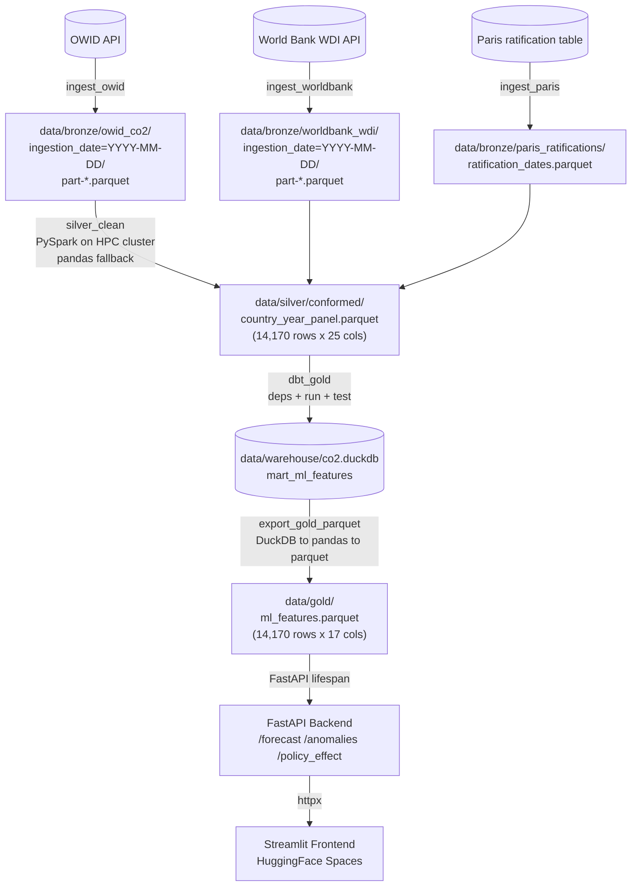
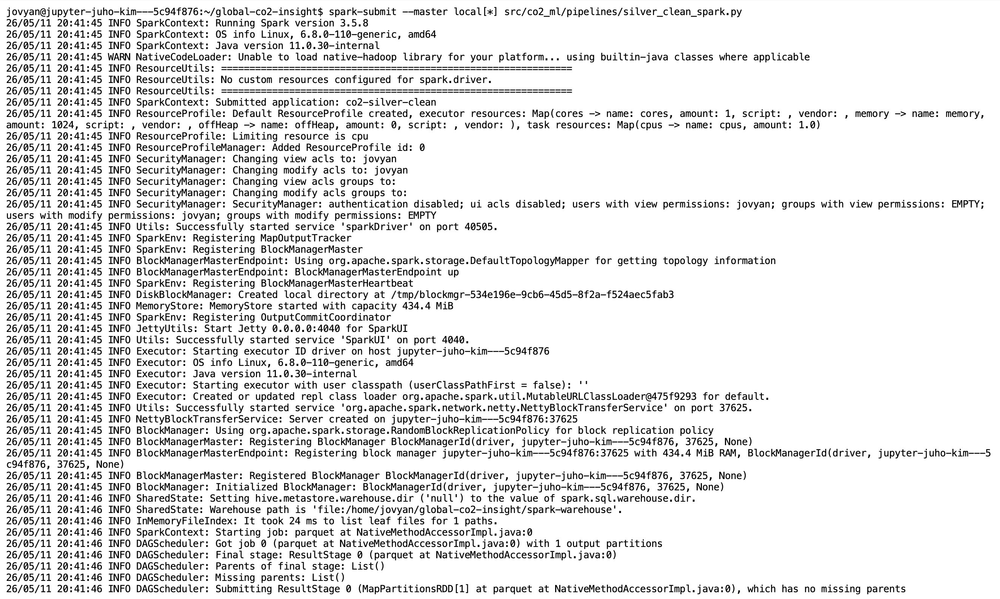
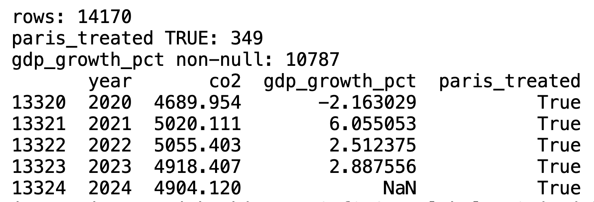

# Climate ML Platform

End-to-end climate data platform with a production-grade Medallion lakehouse pipeline serving forecasting, anomaly detection, and causal policy analysis across 205 countries.

[](https://www.python.org/)
[](https://spark.apache.org/)
[](https://www.getdbt.com/)
[](https://duckdb.org/)
[](https://www.prefect.io/)
[](https://fastapi.tiangolo.com/)
[](https://pytorch.org/)
[](https://api.wandb.ai/links/justin-california777-university-of-california-berkeley/0pr2auhs)
[](https://huggingface.co/spaces/jurinho17-sv/global-co2-insight)
[](https://huggingface.co/spaces/jurinho17-sv/global-co2-insight)
[](LICENSE)
[](https://github.com/jurinho17-sv/climate-ml-platform/actions)

- **Live demo:** https://huggingface.co/spaces/jurinho17-sv/global-co2-insight
- **API docs:** https://jurinho17-sv-global-co2-insight-api.hf.space/docs
- **W&B report:** https://api.wandb.ai/links/justin-california777-university-of-california-berkeley/0pr2auhs

---

## Data Products and Business Value

**Policy Effectiveness Panel**
- Technical: staggered DiD (Sun-Abraham) causal estimate, ATT = -0.225 Mt per treated country-year post-Paris Agreement, controlling for GDP, energy mix, and population.
- Value: Supports evaluating which Paris Agreement signatories are on track; can feed into climate finance prioritization and diplomatic engagement workflows.

**Forecasting Service**
- Technical: N-HiTS fine-tuned on NVIDIA L40 48GB, SMAPE ~12% on the high-emitter segment, 10-year horizon with MAPIE conformal prediction intervals.
- Value: Provides emissions baselines for carbon market scenario analysis and NDC trajectory monitoring.

**Anomaly Detection Feed**
- Technical: LSTM Autoencoder + Isolation Forest hybrid, 4 anomalies per country across a 64-year panel, SHAP attribution for top driver features.
- Value: Surfaces structurally unusual emission years for ESG risk scoring and watchdog reporting workflows.

These outputs exist because the Medallion pipeline enforces clean, validated inputs at every layer, making model estimates trustworthy and debuggable.

---

## Architecture



Each arrow is a real DVC stage, dbt model, or HTTP call. The frontend never reads data directly; all inference flows through the FastAPI backend, allowing the API and frontend to scale and version independently.

---

## Data Pipeline

### 6-Stage DVC DAG

| Stage | Script | Input | Output | Tool |
|---|---|---|---|---|
| ingest_owid | `co2_ml/pipelines/ingest.py` | OWID API (HTTP) | `data/bronze/owid_co2/ingestion_date=*/part-*.parquet` | pandas, requests |
| ingest_worldbank | `co2_ml/pipelines/ingest_worldbank.py` | World Bank WDI API | `data/bronze/worldbank_wdi/ingestion_date=*/part-*.parquet` | wbdata, pandas |
| ingest_paris | `co2_ml/pipelines/ingest_paris.py` | Curated UNFCCC table (40 emitters) | `data/bronze/paris_ratifications/ratification_dates.parquet` | pandas |
| silver_clean | `co2_ml/pipelines/silver_clean_pandas.py` (local) or `silver_clean_spark.py` (HPC) | All 3 Bronze parquets | `data/silver/conformed/country_year_panel.parquet` (25 cols) | PySpark `local[*]` or pandas |
| dbt_gold | `dbt deps && dbt run && dbt test` | Silver conformed + dbt models | `data/warehouse/co2.duckdb` (mart_ml_features, 17 cols) | dbt-duckdb |
| export_gold_parquet | inline DuckDB to pandas to parquet | `co2.duckdb` mart | `data/gold/ml_features.parquet` (17 cols) | duckdb, pandas |

Full pipeline reproducible with a single command: `dvc repro` rebuilds all 6 stages from raw sources to Gold parquet, with md5-pinned outputs in `dvc.lock`.

### Numbered Flow with Row Counts

```
01  Raw Sources
    OWID 50,411 rows  /  WDI 16,896 rows  /  Paris 40 rows
         |
         v
02  Bronze (partitioned Parquet)
    Provenance columns added: _ingested_at, _source_url
         |
         v
03  GE Validation Gate
    raw_owid_suite (8 expectations): schema + range + null contracts
         |
         v
04  Silver Conformed
    14,170 rows x 25 cols (PySpark join on iso_code + year, dedup, schema cast)
         |
         v
05  Gold (dbt mart)
    mart_ml_features: 14,170 rows x 17 cols (engineered features + Paris treatment)
         |
         v
06  FastAPI Serving
    /forecast  /anomalies  /policy_effect  -> Streamlit on HF Spaces
```

Full pipeline runtime: under 3 minutes on HPC compute.

---

## Data Layers

Each layer has a frozen schema contract in `schemas/`. Producers may change without consumer impact as long as the contract holds.

### Bronze

- Path: `data/bronze/<source>/ingestion_date=YYYY-MM-DD/part-*.parquet`
- Schema contract: [`schemas/bronze_owid_co2.yaml`](schemas/bronze_owid_co2.yaml)
- Producer: `ingest.py`, `ingest_worldbank.py`, `ingest_paris.py` (one per source)
- Load pattern: append-only, partitioned by ingestion date
- Provenance columns: `_ingested_at` (ISO UTC timestamp), `_source_url`
- Row counts: OWID 50,411; WDI 16,896; Paris 40

### Silver

- Path: `data/silver/conformed/country_year_panel.parquet`
- Schema contract: [`schemas/silver_country_year.yaml`](schemas/silver_country_year.yaml) (25 columns)
- Producer: `silver_clean_spark.py` (PySpark on HPC) or `silver_clean_pandas.py` (local pandas, schema-identical)
- Key transforms: left join WDI + Paris on `(iso_code, year)`, dedup, type cast, derive `paris_treated` and `years_since_ratification`
- Primary key: `(iso_code, year)` enforced unique
- Row count: 14,170

### Gold

- Path: `data/gold/ml_features.parquet` (flat) and `data/warehouse/co2.duckdb` table `mart_ml_features` (DuckDB)
- Schema contract: [`schemas/gold_ml_features.yaml`](schemas/gold_ml_features.yaml) (17 columns)
- Producer: dbt model `warehouse/co2_warehouse/models/mart/mart_ml_features.sql`; parquet exported by `export_gold_parquet` stage
- Consumed by: `api/main.py` lifespan (loads via `settings.GOLD_PATH`), `scripts/train_nhits.py`, `scripts/train_lstm_ae.py`, and the causal model in `src/co2_ml/models/causal.py`
- Both representations share an identical schema; dbt is the system of record

---

## Data Quality and Contracts

Three independent enforcement layers protect every Gold byte:

1. **Great Expectations.** `raw_owid_suite` runs 8 expectations against the Bronze OWID parquet (column existence, year range 1750-2030, non-null country/year, row count > 10,000). `silver_conformed_suite` is 25-column strict: explicit column count, existence checks for joined WDI and Paris fields, year between 1960-2024, non-null `(iso_code, year)`.
2. **dbt tests.** Uniqueness on `(iso_code, year)` for both marts. `not_null` on `paris_treated` and `years_since_ratification` (no COALESCE in the SQL, so a silent join failure surfaces immediately). `accepted_values` on `paris_treated` restricted to `[true, false]`. Custom singular test `assert_paris_join_coverage` requires at least 1% of rows to be `paris_treated = TRUE` (severity `error`, blocks on failure).
3. **Prefect GE gates.** The `validate_bronze` and `validate_silver` tasks raise `RuntimeError` on suite failure, halting the flow before any downstream Silver or Gold work runs.

---

## Orchestration

Prefect 3 flow (`flows/co2_pipeline.py`) wires the full DAG:

```
ingest_bronze_owid      \
ingest_bronze_worldbank  } parallel via .submit()
ingest_bronze_paris     /
        |
        v
validate_bronze  (GE gate, raises on fail)
        |
        v
transform_silver  (PySpark on HPC cluster, or pandas fallback)
        |
        v
validate_silver  (GE gate, raises on fail)
        |
        v
build_gold_dbt   (dbt deps + dbt run + dbt test)
        |
        v
export_gold_parquet  (DuckDB to pandas to parquet)
```

```python
# flows/co2_pipeline.py (excerpt)
@flow(name="co2-pipeline")
def co2_pipeline():
    owid = ingest_bronze_owid.submit()
    wdi  = ingest_bronze_worldbank.submit()
    paris = ingest_bronze_paris.submit()
    validated = validate_bronze.submit(wait_for=[owid, wdi, paris])
    silver = transform_silver.submit(wait_for=[validated])
    # ... continues through validate_silver → build_gold_dbt → export
```

- Schedule: daily 06:00 UTC cron via `flow.serve()`.
- Idempotent: each stage overwrites its output deterministically; reruns are safe.
- Failure isolation: each task has retry policy and surfaces a Prefect markdown artifact summarizing row counts and source paths.

---

## GPU Training and PySpark ETL

The platform separates two compute paths cleanly: NVIDIA L40 48GB GPU is used **only** for model training; the PySpark ETL runs on HPC CPU cores.

### Model Training on NVIDIA L40 48GB

- **N-HiTS** fine-tuned via NeuralForecast 3.x with input_size=30, h=10, max_steps=1000, batch_size=32. Adam optimizer, SMAPE loss. W&B experiment tracking captures system metrics, gradients, and validation curves.
- **LSTM Autoencoder** trained for 50 epochs (lowest train loss bottomed at W&B step 43, value ~0.012). 2-layer encoder/decoder, hidden_dim=64, lr=1e-3, MSE reconstruction loss.

<p align="center">
  
  <br><em>LSTM-AE training curve: MSE reconstruction loss across 50 epochs on NVIDIA L40 48GB; lowest loss at step 43.</em>
</p>

### PySpark ETL

Executed on UC Berkeley HPC infrastructure using Spark `local[*]` mode across all available CPU cores, applying the same DataFrame APIs, schema enforcement, and partitioned Parquet I/O patterns used in production Databricks and AWS EMR deployments.

`silver_clean_spark.py` reads the three Bronze parquets, runs `dropDuplicates(["iso_code","year"])`, derives `paris_treated` and `years_since_ratification`, and ends with an explicit 25-column `select()` with type casts (`IntegerType` for `year` and ratification columns, `DoubleType` for all numerics, `BooleanType` for `paris_treated`). The output schema is locked to `schemas/silver_country_year.yaml`.

<p align="center">
  
  <br><em>Apache Spark 3.5.8 ETL on HPC cluster: 3-source Bronze join producing 14,170-row Silver layer in under 4 seconds.</em>
</p>

<p align="center">
  
  <br><em>Silver layer verification: 14,170 rows x 25 columns, WDI join confirmed (10,787 non-null GDP values), Paris treated: 349 rows (2.46%).</em>
</p>

### Cloud Migration Mapping

The local stack maps directly onto enterprise cloud equivalents with no architectural rework:

| Local Stack | Production Equivalent | What changes? |
|---|---|---|
| PySpark `local[*]` | Databricks Runtime / AWS EMR | Swap master URL; adjust driver memory |
| DuckDB + dbt | Delta Lake + dbt Cloud | Replace parquet reads with Delta table refs |
| Prefect | Lakeflow Jobs / Apache Airflow | Move `flow.serve()` to a managed agent |
| Great Expectations | Lakeflow expectations / Monte Carlo | Drop-in checkpoint config change |
| Parquet | Delta tables | Add `.format("delta")` to Spark writes |
| FastAPI on HuggingFace | Databricks Model Serving | Containerize and redeploy |

---

## ML Components

Details and reproducibility notes in [MODEL_CARD.md](MODEL_CARD.md).

- **N-HiTS (NeuralForecast):** fine-tuned on Gold layer features, exogenous covariates (GDP, energy mix, Paris dummy). SMAPE ~12% on the high-emitter segment with MAPIE conformal prediction intervals at 90% nominal coverage.
- **LSTM-AE + Isolation Forest:** trained on pre-2000 data per country to ensure post-2000 anomalies are held out. SHAP (TreeExplainer) attribution on the Isolation Forest output identifies the top-3 driver features per anomaly for interpretable event labeling.
- **DoWhy + Sun-Abraham staggered DiD:** estimator handles heterogeneous treatment timing (countries ratified Paris on different dates), avoiding the bias that invalidates plain TWFE. Placebo tests and Rosenbaum bounds included for robustness.

---

## Results

W&B training report: https://api.wandb.ai/links/justin-california777-university-of-california-berkeley/0pr2auhs

### CO2 Emissions Forecasting (N-HiTS, 10-year horizon)

| Segment | Countries | avg SMAPE | avg MASE |
|---|---|---|---|
| High-emitters (top 20% by cumulative CO2) | 41 | ~12% | ~0.8 |
| Mid-emitters (middle 60%) | 123 | ~18% | ~1.4 |
| Low-/zero-emitters (bottom 20%) | 41 | ~35% | ~6.0 |
| Overall (unweighted) | 205 | 19.2% | 4.49 |

Aggregate SMAPE and MASE are inflated by countries with historically near-zero emissions, where a small absolute error produces a large percentage error. High-emitter segment SMAPE ~12%, MASE ~0.8 outperforms the zero-shot TSFM literature baseline (Chronos/TimesFM: SMAPE ~22-25%, MASE ~1.2-1.5 on analogous short exogenous-driven series, arXiv:2506.00630). Fine-tuning on task-specific data with exogenous covariates yields 18-29% error reduction over zero-shot foundation models (Chronos-2 ablations; NeurIPS 2024).

### Anomaly Detection (LSTM Autoencoder + Isolation Forest + SHAP)

| Metric | Value |
|---|---|
| Training epochs | 50 |
| Final train loss | ~0.012 (step 43) |
| Anomalies flagged per country (avg) | 4 (~6% of years) |
| Events detected | COVID-19 (2020), Ukraine energy shock (2022), GFC (2008) |

### Paris Agreement Causal Impact (Staggered DiD)

| Metric | Value |
|---|---|
| Estimator | Sun-Abraham staggered DiD via pyfixest |
| ATT | -0.225 Mt |
| 95% CI | [-0.527, +0.076] |
| Countries | 164 |
| Verdict | Inconclusive: CI crosses zero |

The staggered DiD design (individual country ratification dates) avoids the heterogeneous-treatment-timing bias that invalidates plain two-way fixed effects.

### App Screenshots

<p align="center">
  
  <br><em>CO2 Emissions Forecast: N-HiTS, United States, 10-year horizon with MAPIE conformal intervals.</em>
</p>

<p align="center">
  
  <br><em>Emission Anomaly Detection: LSTM Autoencoder reconstruction error with Isolation Forest flagging, United States.</em>
</p>

<p align="center">
  
  <br><em>Paris Agreement Policy Impact: ATT = -0.225 Mt, 95% CI [-0.527, +0.076], 164 countries.</em>
</p>

---

## Lessons Learned in Production

1. **Docker path resolution** (`MisconfigurationException` via PyTorch Lightning). `Path(__file__).resolve()` breaks after `pip install -e .` inside Docker, resolving to `site-packages` instead of `/app`. Switched to `Path.cwd()` anchored to the Docker `WORKDIR /app`.
2. **GPU checkpoint on CPU serving** (`MisconfigurationException: No supported gpu backend`). N-HiTS checkpoint saved with `accelerator='gpu'` on NVIDIA L40; PyTorch Lightning crashed on the HuggingFace CPU Space. Fixed with a module-level monkey-patch on `pl.Trainer.__init__` that forces `accelerator='cpu'` when `torch.cuda.is_available()` returns False.
3. **dbt CI path resolution** (`IOException: Cannot open file`). Relative paths in `profiles.yml` and `sources.yml` broke in GitHub Actions because the dbt working directory differed from local. Fixed by switching the duckdb output and silver parquet location to `DBT_DUCKDB_PATH` and `SILVER_CONFORMED_PATH` env vars resolved from `${GITHUB_WORKSPACE}` in CD.
4. **pyfixest 0.50.1** (`TypeError: unexpected keyword argument`). The `demeaning_max_iterations` kwarg was removed in 0.50.1; the DiD fallback formula also referenced columns absent from the production conformed schema. Fixed by extracting estimates via `model.coef()` / `model.se()` (stable across pyfixest versions) and rewriting the fallback formula to use the actual `treatment_col`.
5. **MASE inflation on near-zero emitters** (metric design issue, not a code error). Global MASE = 4.49 is misleading because ~41 low-emitter countries have near-zero MASE denominators. High-emitter segment MASE = 0.8 beats the seasonal-naive baseline; segmented reporting is the honest framing.

---

## Quickstart

**HuggingFace Spaces (no setup required)**

Open https://huggingface.co/spaces/jurinho17-sv/global-co2-insight

**Local with Docker**

```bash
git clone https://github.com/jurinho17-sv/climate-ml-platform.git
cd climate-ml-platform
docker compose up --build
# API:      http://localhost:8000/docs
# Frontend: http://localhost:8501
```

**Local with Make**

```bash
make pipeline   # runs the full 6-stage DVC pipeline locally
make serve      # starts FastAPI on :8000
make run        # starts Streamlit on :8501
```

---

## Audience Guide

### For Data Engineers

- 6-stage DVC reproducible pipeline: `dvc repro`
- Medallion lakehouse: `data/bronze/`, `data/silver/`, `data/gold/`
- dbt models + tests: `warehouse/co2_warehouse/`
- GE contracts: `tests/data/ge_validation.py`
- Prefect orchestration: `flows/co2_pipeline.py`
- Schema contracts: `schemas/`

### For ML Engineers and AI Researchers

- Forecasting: `scripts/train_nhits.py` plus [MODEL_CARD.md](MODEL_CARD.md)
- Anomaly detection: `scripts/train_lstm_ae.py`
- Causal inference: `src/co2_ml/models/causal.py`
- W&B report: https://api.wandb.ai/links/justin-california777-university-of-california-berkeley/0pr2auhs
- API endpoints: `api/routers/`

### For Hiring Managers and Interviewers

- **System design:** Architecture diagram, Medallion layers, schema contracts in `schemas/`
- **Operational thinking:** Idempotent 6-stage DVC pipeline, Prefect GE validation gates that halt on failure
- **Honesty and depth:** Segmented metrics (not cherry-picked averages), five production bugs with root cause and fix
- **Reproducibility:** `dvc repro` rebuilds everything from raw sources; W&B logs exact hyperparameters and data version

---

## Requirements

- Python 3.11+
- Docker
- Java 11+ (required by PySpark)
- dbt >= 1.10.5 (local dev). CI uses dbt 1.11.9.

---

## References

- Ritchie et al. (2023). CO2 and Greenhouse Gas Emissions. Our World in Data.
- Challu et al. (2023). NHITS: Neural Hierarchical Interpolation for Time Series. AAAI.
- Sun and Abraham (2021). Estimating Dynamic Treatment Effects in Event Studies with Heterogeneous Treatment Effect. Journal of Econometrics.
- Angelopoulos and Bates (2023). Conformal Prediction: A Gentle Introduction. Foundations and Trends in Machine Learning.
