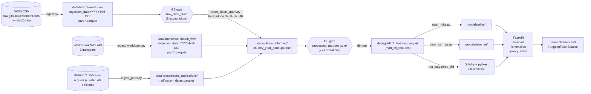

# Data Lineage

End-to-end Bronze → Silver → Gold flow for the climate ML platform. Every box
is a real on-disk artifact; every arrow is a Prefect task in `flows/co2_pipeline.py`
or a dbt model in `warehouse/co2_warehouse/`.



## Layer responsibilities

| Layer | Path | Producer | Consumer | Cadence |
|---|---|---|---|---|
| Bronze | `data/bronze/<source>/ingestion_date=YYYY-MM-DD/` | `ingest*.py` (one per source) | GE bronze gate, Silver Spark job | append on each pipeline run |
| Silver (cleansed) | `data/silver/cleansed/owid_co2.parquet` | `preprocess.py` (pandas, local fallback) | local dev only | overwrite |
| Silver (conformed) | `data/silver/conformed/country_year_panel.parquet` | `silver_clean_spark.py` (PySpark, DataHub) | dbt source `silver_conformed` | overwrite |
| Gold | `data/gold/ml_features.parquet` | dbt `mart_ml_features` | `api/main.py` lifespan, `train_*.py`, causal models | rebuild on each pipeline run |

## Provenance columns

Every Bronze parquet carries:
- `_ingested_at` (UTC timestamp)
- `_source` or `_source_url` (origin marker)

Silver and Gold preserve provenance via the dbt `_built_at` column and the
ingestion-date partition stamp on the upstream Bronze write.

## GE gates

Both gates are enforced inside the Prefect flow — `validate_bronze` and
`validate_silver` raise `RuntimeError` on failure, halting the pipeline before
any downstream task runs. Suites are defined in `tests/data/ge_validation.py`
and stored as JSON under `gx/expectations/`.

## dbt model graph (Gold layer)

```
silver_conformed.country_year_panel  (source)
            |
            v
        stg_co2  (view)
            |
            +-> int_emissions_by_country  (view, YoY metrics)
            |              |
            |              v
            |      mart_country_emissions  (table)
            |
            +-> mart_ml_features  (table — the system of record for ML)
```

Tests on `mart_ml_features`: not_null on `iso_code`, `year`, `paris_treated`,
`years_since_ratification`; uniqueness on `(iso_code, year)`.

## DataHub PySpark execution

The Silver layer is intentionally Spark-driven for scale-readiness. PySpark is
not installed in the local dev environment by design — the Prefect
`transform_silver` task detects this via `importlib.util.find_spec("pyspark")`
and falls back to the pandas `preprocess.py` for local iteration. To execute
the real Spark job:

```bash
# On the DataHub GPU server (NVIDIA L40 48GB):
ssh berkeley-datahub
cd ~/global-co2-insight
git pull origin main
pip install -e . pyspark==3.5.* --break-system-packages
spark-submit --master local[*] src/co2_ml/pipelines/silver_clean_spark.py
```

This is the only step in the pipeline that requires DataHub. Every other layer
runs end-to-end on a developer laptop.
